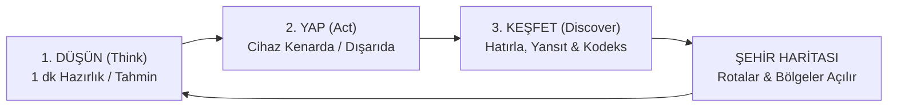

# Sidequest: Gerçek Dünyada Bilişsel Macera ve Proje Bilgi Sistemi
## Yazılım Gerçekleme — Proje Analizi ve Fikir Dokümanı (idea.md)

---

## 1. Giriş ve Yönetici Özeti (Executive Summary)

Günümüz dijital dünyasında mobil ve web uygulamalarının ezici çoğunluğu, kullanıcıların **ekran süresini maksimize etmek**, sonsuz kaydırma (infinite scroll) ve dopamin döngüleri üzerinden dikkat ekonomisini sömürmek üzere tasarlanmıştır. Bu durum bilişsel yorgunluğa, dikkat dağınıklığına, otomatik pilotta yaşama eğilimine ve fiziksel çevreden kopuşa yol açmaktadır.

**Sidequest**, bu paradigmayı kökten tersine çeviren yenilikçi bir **gerçek dünya bilişsel keşif ve görev platformudur**. Projenin temel felsefesi:
> *"Dünya oyun tahtası. Eylemlerin oyunun kendisi. Keşfettiğin şey ise zihnin."*

Sidequest, kullanıcıya ekran başında saatler geçirtmek yerine, dijital dünyada kısa bir hazırlık yaptırıp **cihazı kenara bırakmasını** ve görevi fiziksel dünyada gerçekleştirmesini şart koşar. Görev tamamlanıp geri dönüldüğünde ise deneyim; hafıza, zaman algısı, dikkat ve karar alma süreçlerine dair bilimsel bilişsel fenomenlerle (Kodeks) birleştirilir.

Bu depo, **Yazılım Gerçekleme (Software Implementation)** dersi kapsamında; kullanıcı odaklı web arayüzünü (`sidequest`), açık havada taşınabilirliği sağlayan mobil istemcisini (`mobile`) ve sistemin kurumsal/akademik yönetim altyapısını oluşturan Proje Bilgi Sistemini (`PIS`) tek bir bütünleşik ekosistemde sunmaktadır.

---

## 2. Temel Döngü ve Bilişsel Felsefe (Core Loop)

Sidequest, geleneksel oyunlaştırma (gamification) klişelerinden (streak zorlaması, cezalandırıcı bildirimler, sanal para/coin, liderlik tabloları) tamamen arındırılmıştır. Motivasyon kaynağı dışsal ödüller değil; merak, farkındalık ve içsel keşiftir.



### Çekirdek Döngünün Aşamaları:
1. **Düşün (Think / Prime):** Kullanıcı görevi kabul eder. 1 dakikalık bilişsel hazırlık veya tahmin adımı yapılır (Örn: "Bir rota seç, ne kadar süreceğini tahmin et" veya "Sahnede 4 nesneyi kodla").
2. **Yap (Act - Cihaz Kenarda):** Bu ekranda gezinme menüleri ve dikkat dağıtıcı tüm ögeler gizlenir. Ekranda yalnızca *"Cihazı kenara bırakın"* uyarısı yer alır. Sayaç gizlidir (honour system). Eylem gerçek sokakta, evde veya kampüste tamamlanır.
3. **Geri Dönüş ve Hatırlama (Recall):** Kullanıcı "Geri Döndüm" butonuna bastığında süre hesaplanır; kullanıcıdan detayları hatırlaması istenir.
4. **Yansıtma ve İtiraf (Reflection):** Karar anları, dikkat kırılmaları veya tahmin sapmaları üzerine kısa bir değerlendirme yapılır.
5. **Açığa Çıkarma (Reveal & Codex):** Sonuçlar analitik olarak gösterilir; tetiklenen bilişsel fenomen **Kodeks** kütüphanesine işlenir ve soyut gece haritası (**Şehir**) genişler.

---

## 3. Sistem Mimarisi ve Ekosistem Bileşenleri

Proje, çoklu platform mimarisine ve sorumlulukların ayrılığı (Separation of Concerns) ilkesine uygun 3 ana bileşenden oluşur:

```
yazılım tasarımı / (Yazilim_Gercekleme)
├── idea.md                  # Proje vizyonu, analiz ve gerçekleme dokümanı
├── sidequest/               # Next.js 16 + React 19 + TypeScript Web Platformu
├── mobile/                  # Expo SDK 57 + React Native Mobil Uygulaması
└── PIS/                     # ASP.NET Core 8 MVC Proje Bilgi ve Yönetim Sistemi
```

### 3.1. Web İstemcisi (`sidequest/`)
- **Çatı ve Çekirdek:** Next.js 16 (App Router, Turbopack), React 19, TypeScript (Strict Mode).
- **Tasarım Sistemi ve Stil:** Harici ağır CSS kütüphaneleri (Tailwind, Bootstrap vb.) yerine, özgün tasarlanmış tekil CSS token katmanı (`tokens.css`) ve CSS Modules. 8 farklı şehir tonu (`--hue-teal`, `--hue-indigo`, `--hue-amber` vb.) ve koyu/açık zemin değişkenleri.
- **Tip Güvenliği ve Şemalar:** Tüm görev yapıları, kullanıcı adımları ve kalıcılık modelleri `zod` şemalarıyla çalışma zamanında (runtime) doğrulanır.
- **Test ve Kalite Güvencesi:** Vitest ile 150+ birim/entegrasyon testi, Playwright-core ile uçtan uca (E2E) tarayıcı akış testleri ve ekran görüntüsü turu (`e2e/tour.mjs`).
- **Veri Kalıcılığı:** Local-first mimari; `PlayerRepository` arayüzü arkasında izole edilmiş durum yönetimi.

### 3.2. Mobil İstemci (`mobile/`)
- **Çatı:** Expo SDK 57, React Native 0.86, React 19, TypeScript.
- **Tipografi ve Görsel Uyum:** Web istemcisiyle birebir eşleşen tipografi hiyerarşisi (`Instrument Serif`, `IBM Plex Sans`, `IBM Plex Mono`).
- **Ekranlar ve Akışlar:** Web'deki tüm rota yapısı (`world`, `quest`, `play`, `journey`, `codex`, `playground`, `settings`) mobil ergonomiye uyarlanmış, jest ve dokunmatik etkileşimlerle optimize edilmiştir.
- **Hedef:** Kullanıcının dışarıdaki görevleri sahada (yürüyüşte, toplu taşımada, kampüste) kesintisiz deneyimlemesi.

### 3.3. Proje Bilgi ve İdari Yönetim Sistemi (`PIS/`)
- **Çatı:** ASP.NET Core 8.0 MVC, C#.
- **Mimari:** Katmanlı Mimari (`Controllers` → `Services` → `Repositories` → `Models`).
- **Veri Tabanı & ORM:** Entity Framework Core, SQLite, Code-First Migrations ve Seed Data mekanizması.
- **Güvenlik ve Yönetim:** ASP.NET Core Identity altyapısı ile rol bazlı yetkilendirme (Admin / User), `Areas/Admin/` yönetim paneli, proje/kategori CRUD akışları ve metrik gösterge paneli.

---

## 4. Görev Sistemi ve Oyun Mekanikleri (Quest Mechanics)

Sidequest'te görevler statik metinler değil; tip güvenli, şemalarla tanımlanmış veri yapılarıdır (`src/content/quests/*.ts`).

| Kampanya Adı | Rehber Karakter (NPC) | Odak Bilişsel Alan | Görev Sayısı |
| :--- | :--- | :--- | :--- |
| **Otopilotu Kır** | Haritacı (The Cartographer) | Alışkanlık kırılımları, rota farkındalığı, mekan keşfi | 7 Görev |
| **Gözlemci** | Gözcü (The Watcher) | Çevresel detaylar, değişim körlüğü, seçici dikkat | 7 Görev |
| **Zaman Bükücü** | Saatçi (The Clockmaker) | Öznel zaman algısı, süre tahmini, planlama yanılgısı | 7 Görev |
| **Sahadaki Hafıza** | Arşivci (The Archivist) | Çalışma belleği, mekansal hatırlama, öncelikleme | 7 Görev |
| **Toplam** | **Sezon 01: "Uyan"** | **Bilişsel Keşif Paketi** | **28 Görev** |

### 5 Bilişsel Mikro-Mekanik Motoru:
1. **Sequence-Encode / Sequence-Recall:** Öncelik ve sonralık etkisini (Primacy/Recency Effect) sahada test eden dizi kodlama motoru.
2. **Signal-Filter:** Karışık uyaranlar arasından hedef sinyali ayırt etme motoru (Dikkat filtreleme).
3. **Estimate / Actual:** Gerçek dünyada yapılan eylemlerin tahmini ile fiili ölçümünü kıyaslayan bilişsel sapma motoru.
4. **Rule-Shift:** Beklenmedik kural değişimlerine zihinsel esneklik ve görev değiştirme maliyetini (Switch Cost) ölçen motor.
5. **Priority-Board:** Kısıtlı bütçe ve ani planlama revizyonları karşısında karar alma dinamiklerini simüle eden öncelik panosu.

### Kodeks (Codex) — 16 Bilimsel Keşif:
Görevler tamamlandıkça oyuncu şu bilişsel fenomenleri kendi davranışları üzerinden keşfeder:
- *Planlama Yanılgısı (Planning Fallacy)*
- *Çıpalama Etkisi (Anchoring Bias)*
- *Değişim Körlüğü (Change Blindness)*
- *Görev Değiştirme Maliyeti (Task Switch Cost)*
- *Seçici Dikkat (Selective Attention)*
- *Öncelik ve Sonralık Etkisi (Primacy & Recency Effect)*
- *(ve diğer 10 temel bilişsel olgu)*

---

## 5. Şehir (The City) ve Dinamik Gece Haritası

Oyuncunun ilerlemesi soyut bir gece haritasında somutlaşır.
- Başlangıçta harita karanlıktır; sadece "Dörtyol Ağzı (Crossroads)" açılmıştır.
- Görevler tamamlandıkça 8 ana renkli bölge (**Pazar Yeri, İstasyon, Kütüphane, Park, Gözlemevi, Arşiv, Atölye, Nehir Kıyısı**) ve aralarındaki sokaklar aydınlanır.
- Her tamamlanan görev bölgeye bir araştırma izi (survey mark) bırakır ve ışık yarıçapını büyütür.
- Gizemli görevler (Mystery Quests) nehrin ötesindeki bilinmeyen kadim bölgeleri açar.

---

## 6. Bağlam Motoru (Context Engine)

Kullanıcının ne zaman, nerede ve ne kadar kaynakla görev yapabileceğini analiz eden şeffaf ve deterministik bir öneri motorudur:
- **Konum:** Ev, Dışarısı, İş Yeri, Toplu Taşıma, İnsanlarla Birlikte.
- **Zaman Bütçesi:** 5 dakika, 15 dakika, 30+ dakika.
- **Enerji Durumu:** Düşük, Orta, Yüksek.
- **Gizem İsteği:** Açık veya mühürlü görev tercihi.

Motor, yapay zeka halüsinasyonlarına mahal vermeyen katı deterministik puanlama algoritmasıyla oyuncuya en uygun 3 görevi sıralar.

---

## 7. Güvenlik, Gizlilik ve Etik Standartları (Safety & Privacy)

Sidequest'in en katı bileşenlerinden biri Güvenlik Motorudur (`src/domain/safety.ts`):
- **Asla İstenmeyenler:** Görevler asla kullanıcıdan para harcamasını, yabancılarla zorla konuşmasını, başkalarının fotoğrafını çekmesini veya GPS koordinatlarını paylaşmasını İSTEMEZ.
- **Fiziksel Güvenlik:** Görevler trafiğe kapalı, güvenli ve oyuncunun kendi kontrolünde olan ortamları hedefler.
- **Yerel Öncelikli Gizlilik (Local-First):** Oyuncunun hiçbir verisi sunuculara satılmaz veya izlenmez. Tüm ilerleme cihazda tutulur. Ayarlar menüsünden tüm veriler JSON olarak dışa aktarılabilir (`export`) veya tek tıkla kalıcı olarak silinebilir (`erase`).

---

## 8. Yazılım Gerçekleme Yol Haritası (Implementation Roadmap)

| Aşama | Durum | Kapsam |
| :--- | :--- | :--- |
| **Faz 1: Mimari & Çekirdek Tasarım** | Tamamlandı | Veri modelleri, Zod şemaları, durum makineleri ve tasarım sistemi token'ları kurgulandı. |
| **Faz 2: Web Uygulama Gerçeklemesi** | Tamamlandı | Next.js 16 ile 28 görev, 4 kampanya, 16 kodeks, harita ve runner uçtan uca kodlandı. |
| **Faz 3: Test & Kalite Doğrulama** | Tamamlandı | 150+ Vitest birim testi, E2E tarayıcı testleri ve tip denetimleri (`npm run check`) sıfır hatayla geçti. |
| **Faz 4: Mobil İstemci Portu** | Tamamlandı | Expo / React Native altyapısıyla ekranlar ve mobil kabuk (`Shell`) entegre edildi. |
| **Faz 5: Yönetim Sistemi (PIS)** | Tamamlandı | ASP.NET Core 8 MVC ile idari süreçler, kullanıcı rolleri ve proje takip paneli hazırlandı. |
| **Faz 6: Gelecek Faz (Future Vision)** | Planlandı | PostgreSQL senkronizasyonu, ikili bilişsel deneyler (A/B testing) ve "Görev Gönder" sosyal modülü. |

---

## 9. Kurulum ve Çalıştırma Kılavuzu

### 9.1. Web Platformunu Çalıştırma (`sidequest`)
```bash
cd sidequest
npm install
npm run dev        # http://localhost:3000 adresinde başlar
npm test           # Bilişsel motor ve görev testlerini koşar
npm run check      # Lint, typecheck, test ve build denetimi
```

### 9.2. Mobil Uygulamayı Çalıştırma (`mobile`)
```bash
cd mobile
npm install
npx expo start     # QR kod veya emülatör üzerinden çalıştırma
```

### 9.3. Proje Bilgi Sistemini Çalıştırma (`PIS`)
```bash
cd PIS/project-information-system
dotnet restore
dotnet build
dotnet run         # https://localhost:5001 adresinde başlar
```

---
*Bu doküman, Yazılım Gerçekleme projesinin kavramsal tasarımı, teknik mimarisi, bilişsel altyapısı ve modüler bileşenlerinin detaylı analizi sonucunda hazırlanmıştır.*
